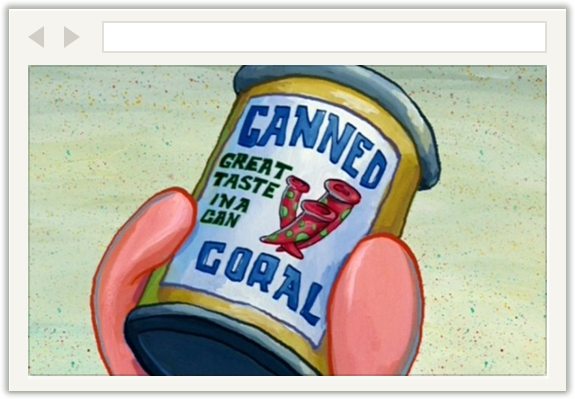

# Canned Coral



> Great Taste in a Can

## Features
A reverse proxy, implemented using [http-proxy](https://npmjs.org/package/http-proxy) and [connect](https://npmjs.org/package/connect),
that enables you to route incoming http requests to different backend services. See "server.js" for details.

### Frameworks
* [Backbone](http://backbonejs.org/) v1.0.x
* [Bootstrap](http://getbootstrap.com/) v3.0.x
* [Font Awesome](http://fortawesome.github.io/Font-Awesome/) v4.0.x
* [Handlebars](http://handlebarsjs.com/) v1.0.x
* [jQuery](http://jquery.com/) v1.10.x
* [Marionette](http://marionettejs.com/) v1.1.x
* [Swag] (http://elving.github.com/swag/) v0.3.x
* [Underscore](http://documentcloud.github.io/underscore/) v1.5.x

### Languages
* [JavaScript](http://www.codecademy.com/tracks/javascript)
* [Stylus](http://learnboost.github.io/stylus/)

### Plugins
* [JavaScript-brunch](https://github.com/brunch/javascript-brunch)
* [CSS-brunch](https://github.com/brunch/css-brunch)
* [Stylus-brunch](https://github.com/brunch/stylus-brunch)
* [Handlebars-brunch](https://github.com/brunch/handlebars-brunch)
* [Uglify-JS-brunch](https://github.com/brunch/uglify-js-brunch)
* [Clean-CSS-brunch](https://github.com/brunch/clean-css-brunch)
* [JSHint-brunch](https://github.com/brunch/jshint-brunch)

## Getting started
Requires [Brunch](http://brunch.io/) 1.7.x

    $ brunch new git://github.com/timebox-designs/canned-coral.git [optional-output-dir]
    $ cd [optional-output-dir]
    $ brunch w -s

or

    $ git clone git://github.com/timebox-designs/canned-coral.git
    $ npm install
    $ brunch w -s

## Bits and Pieces

### server.js
``` js
"use strict";

var http = require("http"),
    httpProxy = require("http-proxy"),
    connect = require("connect");

exports.startServer = function (port, path, callback) {
    var proxy = new httpProxy.RoutingProxy();

    var app = connect()
        .use(connect.favicon())
        .use(connect.logger("dev"))
        .use(connect.static(path))

        // For demonstration purposes only. Route all incoming http requests starting on path "/json"
        // to freegeoip.net. See the the default/index view on see how this route is called.

        .use("/json", function (req, res) {
            req.url = req.originalUrl;

            proxy.proxyRequest(req, res, {
                host: "freegeoip.net",
                port: "80"
            });
        });

    http.createServer(app).listen(port, callback);
};
```

### default/index.js
``` js
var Backbone = require("backbone"),
    View = require("./my-ip");

// For demonstration purposes only. This simple model defines the URL path to a RESTFul endpoint made available
// on freegeoip.net, which returns geolocation information related to IPs. See "server.js" for details on how
// this route is handled.

var Model = Backbone.Model.extend({
    url: "/json"
});

var Layout = Backbone.Marionette.Layout.extend({
    template: require("./template"),

    regions: {
        ip: "#my-ip"
    },

    onShow: function () {
        var self = this, model = new Model();

        model.fetch()
            .done(function () {
                self.ip.show(new View({model: model}));
            });
    }
});

module.exports = Layout;
```
